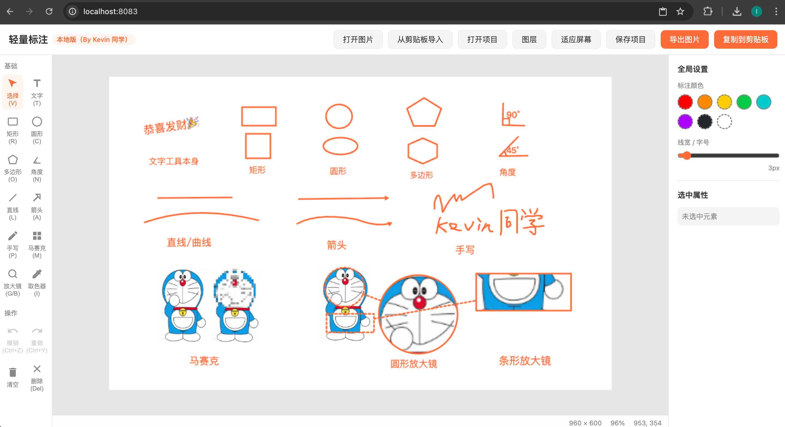

# Stuk 标注

一个纯前端、零依赖的轻量图片标注工具。

## 项目背景

作者是一个理工科代码小白，靠 Vibe Coding 一步步把工具攒出来，没有什么宏伟蓝图，只是为了给娃做题讲解时，能够随手画圈、写文字、打马赛克、标角度，让讲题过程更清楚一点。



## 功能介绍

- **打开图片 / 空白画布**：支持从本地打开 JPG / PNG / WebP，也可以直接创建一张空白画布作为底图。
- **剪贴板粘贴**：直接从剪贴板粘贴图片，会自动作为独立对象置于画布之上，可拖拽、缩放、旋转，不会覆盖已有标注。
- **多类型标注**：
  - 文字（双击直接编辑）
  - 矩形、圆形、多边形（支持边数与正多边形切换）
  - 直线、箭头（双击可增加曲线控制锚点，转换为贝塞尔曲线）
  - 手写涂鸦
  - 马赛克（可调节模糊粒度）
  - 放大镜（圆形 / 长条两种）
  - 角度标注（自动计算并显示角度值）
- **图层管理**：右侧图层列表可查看全部元素，支持拖拽调整层级顺序；越靠上的元素在画布中越优先显示。
- **选中编辑**：选中对象后可在右侧面板修改颜色、线宽、字号、填充、线型、旋转角度等属性。
- **撤销 / 重做**：完整支持操作历史回溯。
- **项目保存与打开**：可将当前画布与所有标注保存为 `.stukproj` 项目文件，重新打开后所有标注仍然是独立对象，可继续移动、缩放、旋转、修改文字和样式。这是很多同类产品（只能导出静态图片）所没有的能力。支持覆盖保存或另存为。
- **框选与多选批量操作**：在空白处拖拽可进行框选，虚线框内的标注会被批量选中。选中多个标注后可统一修改颜色、线宽、字号、填充、线型、放大倍数、模糊粒度、边数/正多边形、角度/字号等属性，也可批量拖拽移动、批量复制、批量删除。
- **复制标注**：选中单个或多个标注后，按 `Cmd+C`（或 `Ctrl+C`）即可复制一份同样的标注。
- **等比例缩放**：拖动四角控制点时，缩放会保持原始宽高比例。
- **像素级微调**：按键盘方向键 `↑ ↓ ← →` 可对选中标注进行像素级移动；按住 `Shift` 可加速移动 10 像素。
- **原生文件覆盖与路径记忆**：在支持 File System Access API 的浏览器（如 Chrome/Edge）中，打开的项目会记住原文件路径，覆盖保存直接写回原文件，另存为也会默认回到原文件夹；不支持时自动回退到传统下载行为。
- **导出与复制**：一键导出为 PNG 图片，或复制到剪贴板。

## 快速开始

**在线试用**：https://luekemia.github.io/stuk-annotate/

无需安装任何依赖，直接在浏览器中打开 `index.html` 即可使用。

```bash
# 如果你有 Python，可以本地起一个 HTTP 服务
python3 -m http.server 8080
# 然后访问 http://localhost:8080
```

## 常用快捷键

| 快捷键 | 功能 |
|--------|------|
| `V` | 选择工具 |
| `T` | 文字工具 |
| `R` | 矩形工具 |
| `C` | 圆形工具 |
| `O` | 多边形工具 |
| `N` | 角度工具 |
| `L` | 直线工具 |
| `A` | 箭头工具 |
| `P` | 手写工具 |
| `M` | 马赛克工具 |
| `G` | 圆形放大镜 |
| `B` | 长条放大镜 |
| `I` | 取色器 |
| `Ctrl + Z` | 撤销 |
| `Ctrl + Y` | 重做 |
| `Cmd / Ctrl + C` | 复制选中标注 |
| `Del` | 删除选中对象 |
| `↑ ↓ ← →` | 像素级移动选中标注 |
| `Shift + 方向键` | 加速移动 10 像素 |
| `滚轮` | 缩放画布 |
| `中键 / 空格 + 拖拽` | 平移画布 |

## 技术说明

- 纯 HTML5 + CSS3 + JavaScript（ES6+），零第三方依赖。
- 基于 HTML5 Canvas 2D 实现全部绘制与交互逻辑。
- 所有数据均保存在本地，不会上传任何图片或标注信息。

## 开源协议

MIT License — 随意使用、修改和分发。
